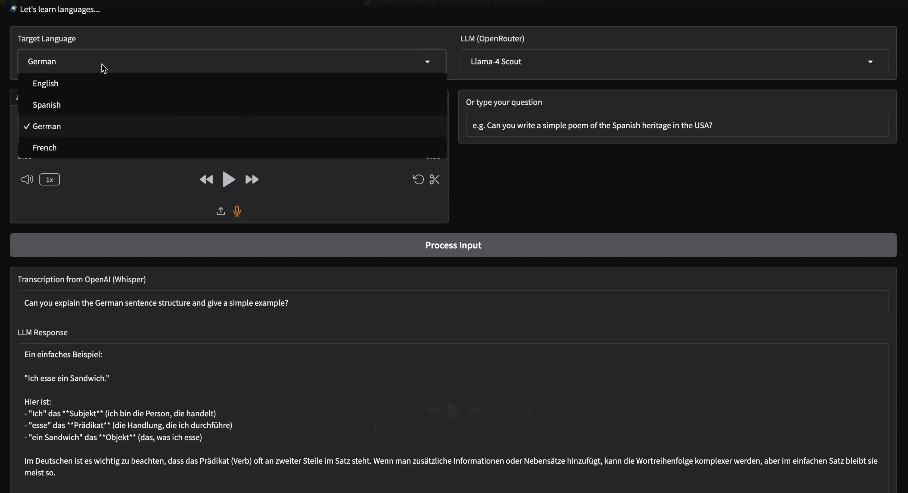

# Polygot Language Helper

This project implements a web-based interactive language learning platform. I built this to 
help my journey learning German.



## Methology
This is sequencial pipeline design based in `STT->LLM->TTS`. The workflow is as follows:
1. **Input**: Accept either spoken input (mic) or typed text.
2. **Speech-to-Text (STT)**: If audio is provided, the cheap OpenAI `4o-mini`is used (approx. $0.003/min).
3. **LLM**: The trascribed text (or typed input) is passed to a *free* LLM (with OpenRouter) with appropiate context, returning your question in the **target** language. 
4. **Text-to-Speech (TTS)**: The response is spoken using a the same OpenAI `4o-mini`(approx. 0.015/min).

## LLMs
I'm currently allowing for experimentation the following models:

* `deepseek-r1-distill-llama-70b:free` (DeepSeek Llama 70B)
* `meta-llama/llama-3.3-70b-instruct:free` (Llama-3 70B)
* `meta-llama/llama-4-scout:free` (Llama-4 Scout - default)
* `meta-llama/llama-4-maverick-17b-128e:free` (Llama-4 Maverick)

As you can see, all my models are 70B+, that's because I want consistent and clear sentences in a variety of topics (and contextual information as languages are learned that way). The Llama-4 have a MoE architecture, so very interesting conversation can be obtained, which much better translations. *Personally, Llama-4 Scout works smoothly. 

> [!IMPORTANT]
> Currently I'm enforcing `max_completion_tokens` to 1024. This is for testing. 
> It can be easily modified to a larger value. Change it accordingly!.
> ```python
> completion = client.chat.completions.create(
>       model=model_id,
>       messages=messages,
>       max_completion_tokens=1024 * 8 # CHANGE HERE 
>     )
> ```

## Installation 

You need Python 3.x and API keys for OpenAI and OpenRouter

1. Clone the repository.
2. Install packages
```bash
pip install openai gradio
```
3. Set API environment keys.
```bash
export OPENROUTER_API_KEY="your_openrouter_api_key"
export OPENAI_API_KEY="your_openai_api_key" # Optional, if only using OpenRouter for LLM. Required for STT/TTS.
```

## Usage
Run in the terminal

```bash
python app.py
```
and locate the `localhost` port provided by gradio. 

